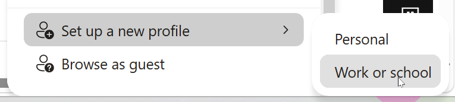
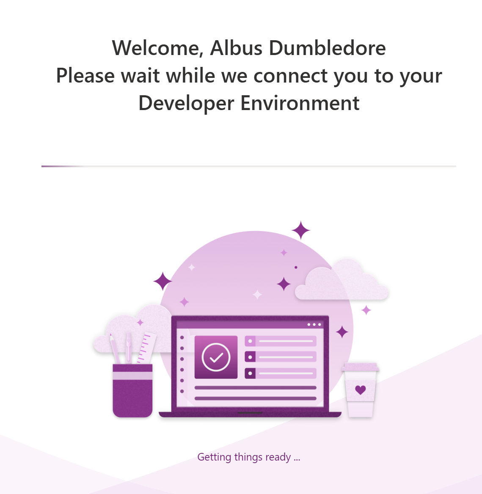

# Exercise 0: Setup

## Overview
In this exercise, you'll set up your development environment so you're ready to build apps in the workshop. You'll either use your own company/personal account or a provided demo user to access Power Apps and create a developer environment.

## Prerequisites

> [!IMPORTANT]
> **Using your own account?** You need an environment with permission to create Dataverse tables, web resources, and Model-Driven Apps (ideally the Security role of **System Customizer** or **Administrator**).
>
> **Using a demo account?** You'll find a demo user on a sheet at your place — no setup required on your end other than logging in.

---

## 🎯 Mainquest: Get Started with Your Development Environment

### Step 1: Log In

1. Open a **private/incognito browser window** or create a new browser profile — this avoids conflicts with existing sessions

2. Navigate to **Power Apps** ([make.powerapps.com](https://make.powerapps.com))
3. A demo environment will be created for you automatically

> [!TIP]
> **Why a private window?** Using a private window or a separate browser profile ensures you don't accidentally use cached credentials from another account. This keeps your workshop environment clean and isolated.

---

## ⚠️ Important: Account Expiration

> [!WARNING]
> **The demo user accounts will be deleted in the coming days.** If you want to save something from the workshop, do it immediately afterwards. All data and finished solutions will be provided, so there is no need to save those.

---

## 🥳 Setup Complete!

**You're ready to go!** Proceed to [Exercise 1: Building Your First Model-Driven App](01-model-driven-basics.md) to start building your Expense Tracker app.