# Exercise 1: Building Your First Model-Driven App

## Overview
In this exercise, you'll build a complete **Expenses Tracker** model-driven app from scratch. You'll learn how to create tables, establish relationships, customize forms and views, and see how model-driven apps provide built-in CRUD operations automatically.

## Scenario
We're building an expense tracking system where:
- **Trips** contain multiple **Expense Reports** 
- Each trip can have several invoices/expenses that need to be tracked and approved
- Users can easily manage all their travel expenses in one organized system

## Learning Objectives
- Create a solution and publisher for proper application lifecycle management
- Create and configure Dataverse tables
- Establish table relationships using lookups
- Customize main forms and views
- Build a model-driven app with minimal configuration
- Understand built-in CRUD operations

---

## Part 1: Create Solution and Publisher

### Step 1: Create a Publisher

1. Navigate to **Power Apps** ([make.powerapps.com](https://make.powerapps.com))
2. Select your environment
3. Select **Solutions** in the left navigation

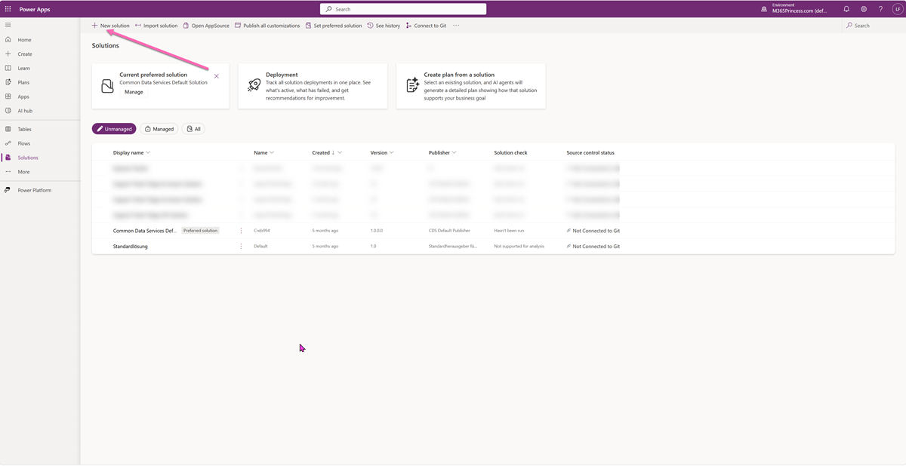

4. Select **+ New solution**
5. Before we create the solution, we need a publisher. Select **+ New publisher**
6. Fill in the publisher details using **your initials**:
   - **Display name**: `[Your Initials]` (e.g., "LF")
   - **Name**: `[yourinitials]` (e.g., "lf" - this will auto-populate)
   - **Prefix**: `[your initials]` (e.g., "lf" - keep it short, 2-4 characters)
 
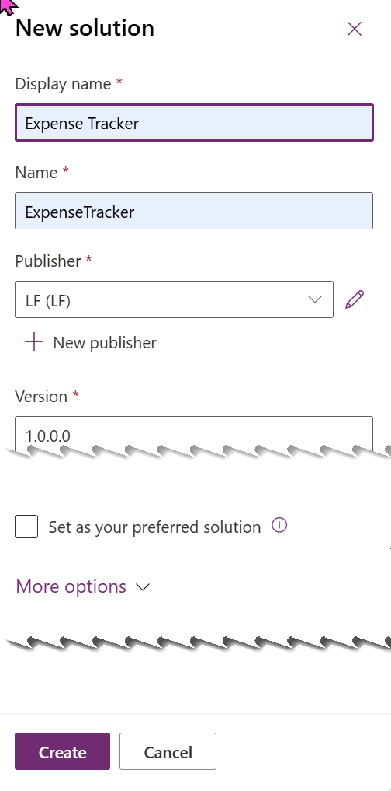

7. Select **Create**

### Step 2: Create the Solution

1. Now back in the **New solution** dialog:
   - **Display name**: `Expense Tracker App`
   - **Name**: `ExpenseTrackerApp` (auto-populated)
   - **Publisher**: Select **[Your Initials]** (the publisher you just created)
   - **Version**: `1.0.0.0` (default)
   - **Description**: `Complete expense tracking solution for business trips`

2. Select **Create**

Your solution should now look like this: 

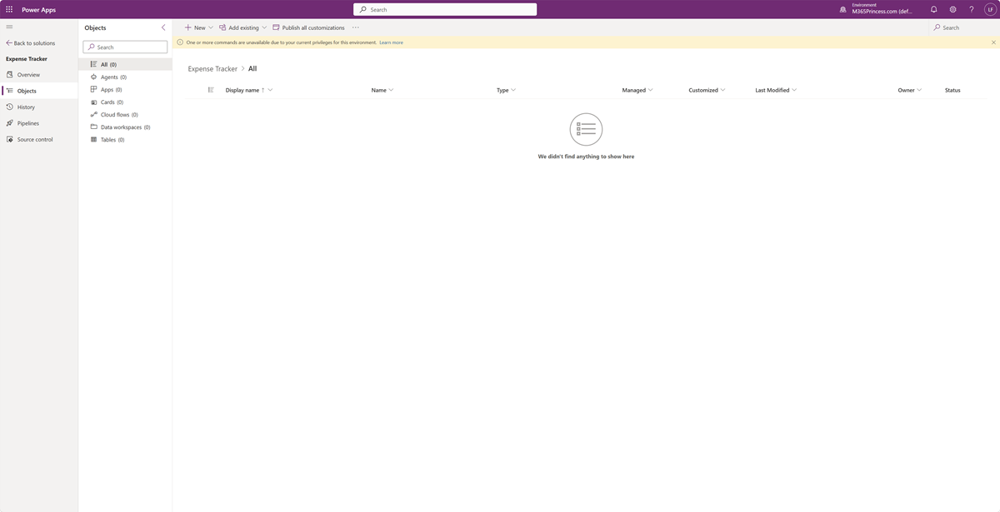

### Step 3: Work Within Your Solution

From now on, **all components will be created within this solution**. This ensures:
- ✅ Proper component organization
- ✅ Easy deployment between environments  
- ✅ Clean application lifecycle management
- ✅ Simplified backup and version control

---

## Part 2: Create the Tables

### Step 4: Create the Trip Table

1. You should now be **inside your Expense Tracker App solution**
2. Select **+ New** → **Table** → **Table (advanced properties)**

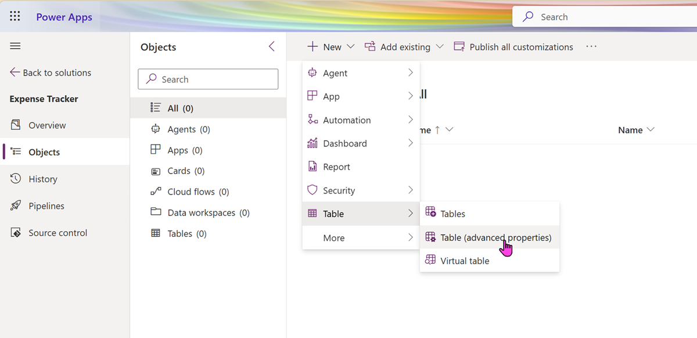

3. In the **New table** panel:
   - **Display name**: `Trip`
   - **Plural display name**: `Trips` (auto-populated)
   - **Name**: `[prefix]_Trip` (e.g., `lf_Trip` - note your initials prefix)

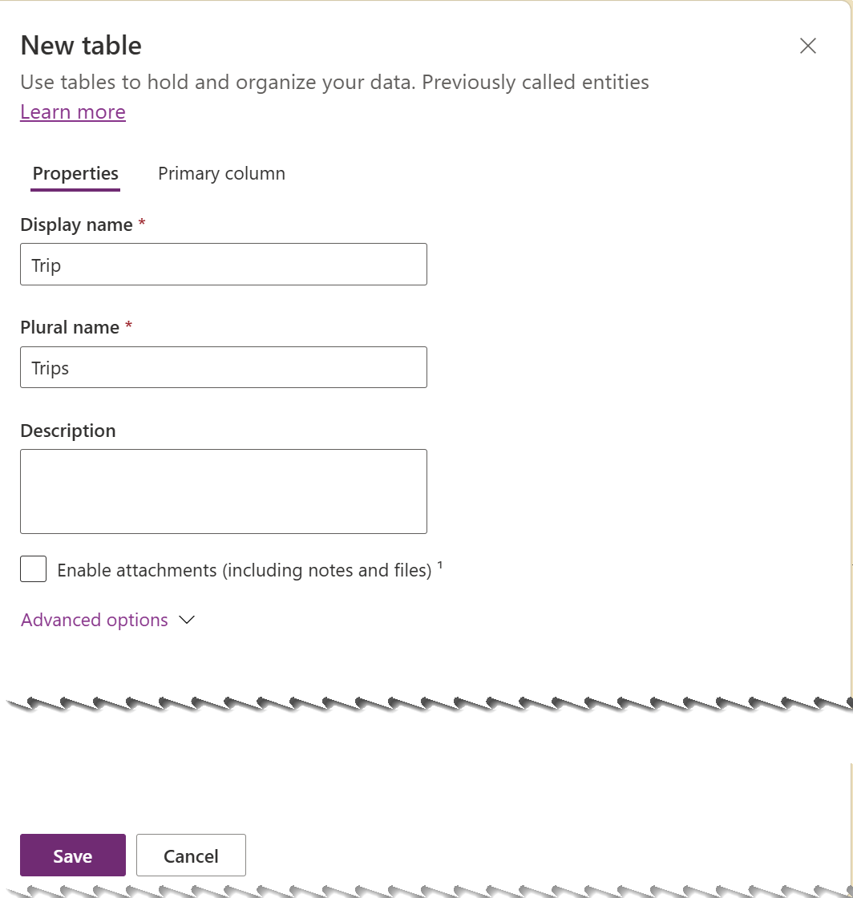

4. Select **Save**

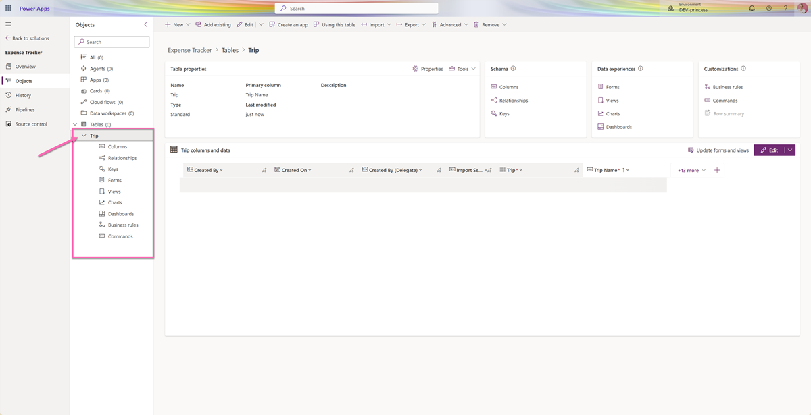

5. **Configure the Primary Column**: Before adding custom columns, let's make the primary column more descriptive:
   - In the table designer, locate the **Name** column (this is the primary column)
   - Select the **Name** column to edit its properties
   - Change the **Display name** from "Name" to `Trip Name`
   - This makes it clearer what this field represents

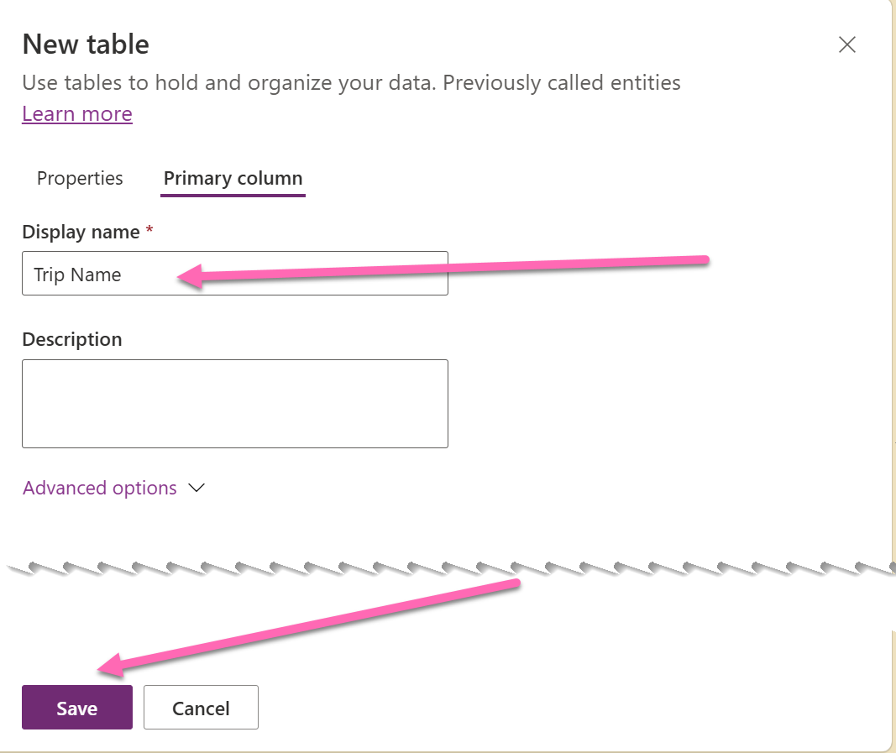

6. **Understanding System vs Business Status**: Every Dataverse table automatically includes a **Status** column for system-level record state (Active/Inactive). This is different from business status tracking, so we create our own **Trip Status** column for business logic (Planning, In Progress, etc.). This is why we name it "Trip Status" - to differentiate from the system Status.

7. Add the following columns by selecting **+ New column**:

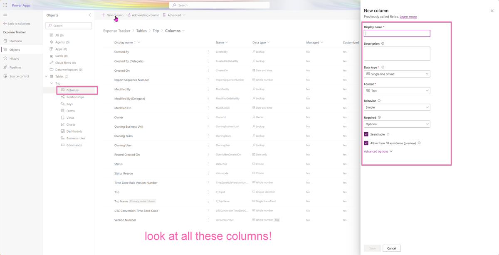

> 💡 **Important - Descriptions Power Tooltips**: The **Description** field for each column becomes the tooltip text in the model-driven app. This is crucial for usability and accessibility - users will see these descriptions when they hover over field labels or need guidance. Write clear, helpful descriptions that explain what users should enter.

| Column Name      | Data Type           | Format    | Business Required | Description                                                 |
| ---------------- | ------------------- | --------- | ----------------- | ----------------------------------------------------------- |
| Destination      | Single Line of Text | Text      | Yes               | City, country, or location where the trip is taking place   |
| Start Date       | Date and time       | Date only | Yes               | The date when the business trip begins                      |
| End Date         | Date and time       | Date only | Yes               | The date when the business trip ends                        |
| Trip Purpose     | Choice              | N/A       | No                | The business reason for this trip (meeting, training, etc.) |
| Estimated Budget | Currency            | Currency  | No                | Expected total cost for this trip including all expenses    |
| Trip Status      | Choice              | N/A       | Yes               | Current stage of trip planning and execution                |

8. **Create Global Choice Sets**: Instead of creating local choices, we'll create global choice sets that can be reused across tables. This ensures consistency and easier maintenance.

   **For Trip Purpose:**
   - When configuring the Trip Purpose column, select **Sync with global choice**
   - Select **+ New choice** to create a new global choice set
   - Name: `Trip Purpose Values` (note the "Values" suffix - this is a naming convention)
   - Add these choices:
     - Business Meeting
     - Training
     - Conference
     - Customer Visit
     - Other

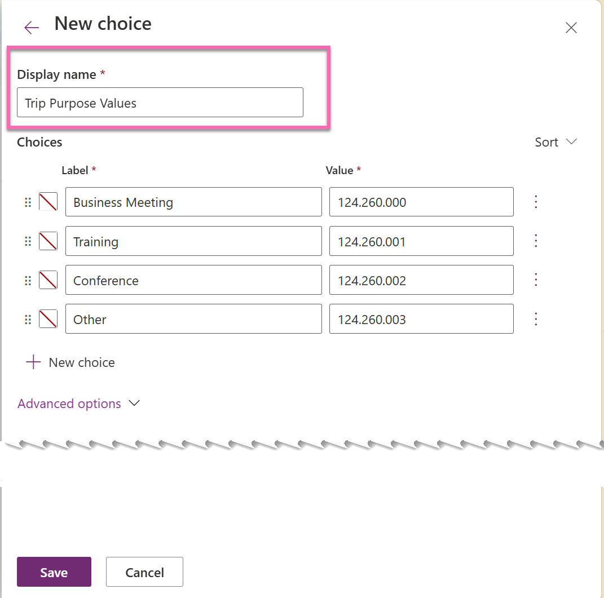

   **For Trip Status:**
   - When configuring the Trip Status column, select **Sync with global choice**
   - Select **+ New choice** to create a new global choice set
   - Name: `Trip Status Values`
   - Add these choices:
     - Planning (Default)
     - In Progress
     - Completed
     - Cancelled

> 💡 **Why Global Choice Sets?** Global choice sets can be reused across multiple tables and even environments. If you later need to add a "Project Status" that uses the same values, you can reuse `Trip Status Values`. They also ensure consistent spellings and reduce maintenance.

9. Configure **Data Types and Formats** carefully:
   - **Text fields**: Use "Text" format (not "Text area" unless you need multiple lines)
   - **Date fields**: Select "Date and time" data type, then choose "Date only" format
   - **Currency fields**: Will automatically use your environment's currency format
   - **Choice fields**: Always sync with global choices for reusability
   - **Descriptions**: Write clear, user-friendly descriptions - they become tooltips in the app for better usability and accessibility compliance

10. Select **Save** (this saves the table to your solution)

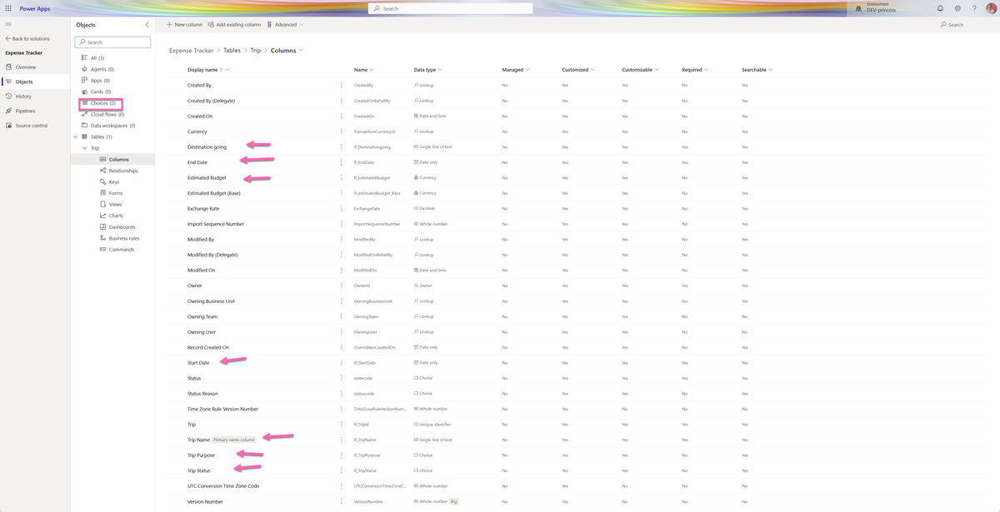

### Step 5: Create the Expense Report Table

1. From your solution, select **+ New** → **Table** → **Table (advanced properties)**

2. In the **New table** panel:
   - **Display name**: `Expense Report`
   - **Plural display name**: `Expense Reports` (auto-populated) 
   - **Name**: `[prefix]_ExpenseReport` (e.g., `lf_ExpenseReport` - note your prefix)
3. Select **Save**

4. **Configure the Primary Column**: Similar to the Trip table, let's make the primary column more descriptive:
   - In the table designer, locate the **Name** column (this is the primary column)
   - Select the **Name** column to edit its properties  
   - Change the **Display name** from "Name" to `Expense Title`
   - This makes it clear this field describes the expense

5. Add the following columns by selecting **+ New column**:

> 💡 **Remember**: Descriptions become tooltips for users - make them helpful and clear!

| Column Name            | Data Type     | Format    | Business Required | Description                                                      |
| ---------------------- | ------------- | --------- | ----------------- | ---------------------------------------------------------------- |
| Expense Date           | Date and time | Date only | Yes               | The date when this expense was incurred during the trip          |
| Amount                 | Currency      | Currency  | Yes               | Total cost of this expense (in your local currency)              |
| Expense Category       | Choice        | N/A       | Yes               | Type of business expense (meals, transport, accommodation, etc.) |
| Payment Method         | Choice        | N/A       | Yes               | How this expense was paid (company card, personal, cash)         |
| Receipt Attached       | Choice        | Yes/No    | No                | Indicates if you have a receipt or proof of purchase             |
| Business Justification | Text          | Text area | No                | Explanation of why this expense was necessary for business       |
| Trip                   | Lookup        | N/A       | Yes               | Select which trip this expense belongs to                        |

6. **Create Global Choice Sets** for reusable options:

   **For Expense Category:**
   - When configuring the Expense Category column, select **Sync with global choice**
   - Select **+ New choice** to create a new global choice set
   - Name: `Expense Category Values`
   - Add these choices:
     - Meals & Entertainment
     - Transportation
     - Accommodation
     - Fuel
     - Parking
     - Other

   **For Payment Method:**
   - When configuring the Payment Method column, select **Sync with global choice**
   - Select **+ New choice** to create a new global choice set
   - Name: `Payment Method Values`
   - Add these choices:
     - Company Credit Card
     - Personal Reimbursement
     - Cash Advance

> 💡 **Global Choice Reuse**: Notice how we're building a library of reusable choice sets. In future exercises, we might reuse these same choice sets or create new ones following the "Values" naming convention.

7. **Important Format Notes**:
   - **Receipt Attached**: Use Choice data type with "Yes/No" format (not the standalone Yes/No data type). This approach is more flexible and consistent with other choice fields.
   - **Business Justification**: Use Text data type with "Text area" format for multi-line input
   - **Date fields**: Always select "Date and time" data type, then choose "Date only" format
   - **Currency fields**: Will automatically use your environment's currency settings

8. **Don't save yet** - we need to add the lookup relationship first

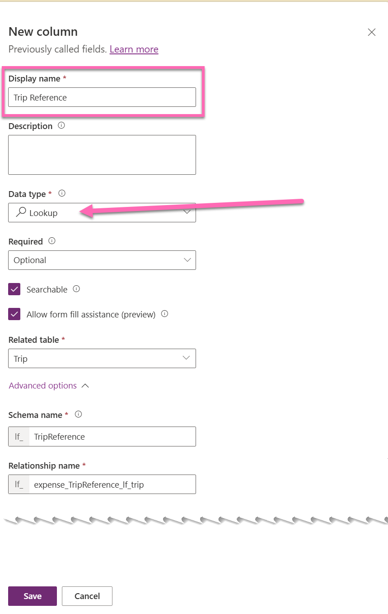

---

## Part 3: Create the Relationship

### Step 6: Add the Trip Lookup to Expense Report

1. While still in the Expense Report table editor, find the **Trip** column
2. Select the **Trip** column to configure it
3. Set the following properties:
   - **Data type**: Lookup
   - **Related table**: Trip
   - **Required**: Yes

4. Select **Save** to save the relationship

5. Select **Save and exit** to finish the Expense Report table

### Understanding the Relationship
You've just created a **1:N (one-to-many)** relationship where:
- One Trip can have many Expense Reports
- Each Expense Report belongs to exactly one Trip
- This is accomplished through a lookup column on the Expense Report table

---

## Part 4: Customize Forms and Views

### Step 7: Customize the Trip Main Form

1. Go back to **Tables** and select your **Trip** table
2. Select **Forms** tab
3. Find the **Information** form (Main form type) and select to edit it
4. Customize the form layout:
   - **Header section**: Add Trip Name and Trip Status
   - **General section**: Organize fields in two columns:
     - Left column: Destination, Start Date, Trip Purpose  
     - Right column: Estimated Budget, End Date
   - Add a new **Details** section below with: Business Justification (if you added this field)

5. **Add a Related Records subgrid**:
   - From the **Table columns** panel, drag **Related** → **Expense Reports** onto the form
   - This will show all expense reports related to this trip
   - Position it at the bottom of the form

6. Select **Save and publish**

### Step 8: Customize the Trip Main View

1. Still in the Trip table, select **Views** tab
2. Find the **Active Trips** view and select to edit it
3. Configure the view columns (in this order):
   - Trip Name
   - Destination  
   - Start Date
   - End Date
   - Trip Status
   - Estimated Budget

4. Set **Sort by**: Start Date (Descending) so newest trips appear first
5. Select **Save and publish**

### Step 9: Customize the Expense Report Main Form

1. Navigate to your **Expense Report** table
2. Select **Forms** tab → edit the **Information** form
3. Organize the form:
   - **Header**: Expense Title and Amount
   - **General section**:
     - Left column: Trip, Expense Date, Expense Category
     - Right column: Payment Method, Receipt Attached
   - **Details section**: Business Justification

4. Select **Save and publish**

### Step 10: Customize the Expense Report Main View  

1. In Expense Report table, select **Views** tab
2. Edit the **Active Expense Reports** view
3. Configure columns:
   - Expense Title
   - Trip (this will show the related trip name)
   - Expense Date
   - Amount
   - Expense Category
   - Payment Method

4. Set **Sort by**: Expense Date (Descending)
5. Select **Save and publish**

---

## Part 5: Create the Model-Driven App

### Step 11: Build the App

1. From within your **Expense Tracker App solution**, select **+ New** → **App** → **Model-driven app**
2. In the app designer:
   - **Name**: `Expense Tracker`
   - **Description**: `Track business trip expenses and manage approvals`
3. Select **Create**

4. In the modern app designer:
   - Select **+ Add page** → **Table based view and form**
   - Select **Trip** table (it will show with your prefix, e.g., `lf_Trip`)
   - This automatically adds both the view and form pages for trips
   - Select **Add**

5. Repeat for Expense Reports:
   - Select **+ Add page** → **Table based view and form** 
   - Select **Expense Report** table (it will show with your prefix, e.g., `lf_ExpenseReport`)
   - Select **Add**

6. **Organize Navigation**:
   - In the navigation area, arrange items:
     - Trips (first)
     - Expense Reports (second)

7. Select **Save** then **Publish**

> 💡 **Solution Benefits**: Notice how all your components (tables, app) are now organized within your solution. This makes deployment to other environments much easier!

### Step 12: Test Your App

1. Select **Play** to launch your app
2. **Test the built-in CRUD operations**:

   **Create**: 
   - Select **Trips** in navigation
   - Select **+ New** in command bar
   - Fill out a sample trip and save
   
   **Read**: 
   - View the trip in the list
   - Select a trip to open the detailed form
   - Notice the Related Expense Reports section
   
   **Update**: 
   - Edit any field in the trip
   - Select **Save** 
   
   **Delete**: 
   - Select a trip from the list
   - Select **Delete** in command bar (be careful!)

3. **Test the Relationship**:
   - Open a trip record
   - In the **Expense Reports** subgrid, select **+ New Expense Report**
   - Notice the Trip field is automatically populated
   - Fill out the expense details and save
   - See how it appears in both the subgrid and the Expense Reports main area

---

## Part 6: Understanding What You Built

### Built-in Features You Get "For Free"

✅ **Complete CRUD Operations**: Create, Read, Update, Delete - no coding required

✅ **Data Validation**: Required fields, data type validation automatically enforced

✓️ **Relationship Navigation**: Select from trips to expenses and back seamlessly  

✅ **Search and Filtering**: Use the search box and filter options in views

✅ **Responsive Design**: Works on desktop, tablet, and mobile devices

✅ **Security**: Built-in role-based security (when configured)

✅ **Audit Trail**: Tracks who created/modified records and when (when enabled)

### The Power of Model-Driven Apps

**What made this so easy?**
- **Metadata-driven**: The platform uses your table and relationship definitions to automatically generate the UI
- **Convention over configuration**: Sensible defaults for forms, views, and navigation
- **Built-in business logic**: Standard operations work immediately without custom development

**When would you customize the command bar?**
While most standard operations are built-in, you might add custom buttons for:
- Triggering Power Automate flows
- Complex business processes (e.g., "Submit for Approval")
- Integration with external systems
- Custom calculations or reports

> 💡 **Pro Tip**: The component library approach mentioned in the overview is the easiest way to add custom command bar buttons, but for most business apps, the standard commands are sufficient.

---

## 🎯 Challenge Exercise

If you finish early, try these enhancements:

1. **Add a Status Reason**: Create a status reason field on Expense Report with values like "Draft", "Submitted", "Approved", "Rejected"

2. **Create a Business Rule**: Make the "Business Justification" field required when the expense amount is over $100

3. **Add a Calculated Field**: Create a calculated field on Trip that shows the total of all related expense reports

4. **Create a Custom View**: Build a view that shows only expenses over $50 from the last 30 days

---

## ✅ Exercise Complete!

**You've successfully built a complete business application with:**
- ✅ Two related tables with proper data structure
- ✅ Customized forms for optimal user experience  
- ✅ Tailored views for efficient data management
- ✅ A model-driven app with full CRUD functionality
- ✅ Understanding of built-in vs. custom functionality

**Next Steps**: In Exercise 2, you'll learn how to create custom pages that bring canvas app flexibility into your model-driven app while maintaining the enterprise structure you just built.

---

## Troubleshooting

**Can't see your tables in app designer?** 
- Refresh the browser and try again
- Make sure tables are saved and published

**Lookup field not showing Trip names?**
- Verify the Trip table has a "Name" or primary field configured
- Check that the relationship was created correctly

**App won't load?**
- Ensure you have sufficient permissions in the environment
- Try publishing the app again

**Need Help?** Raise your hand - we're here to help! 🙋‍♀️🙋‍♂️
