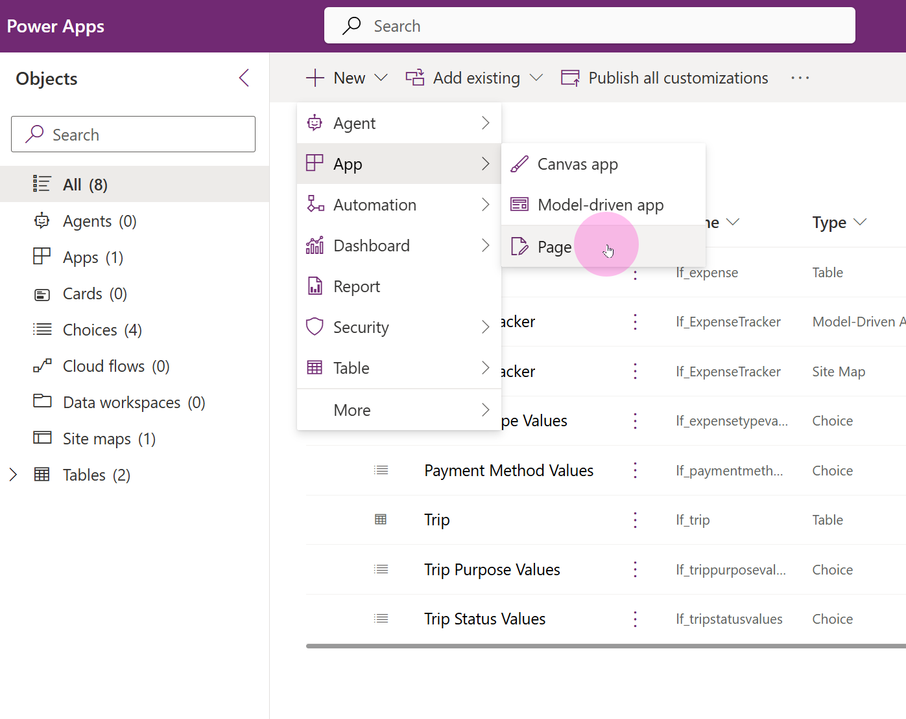
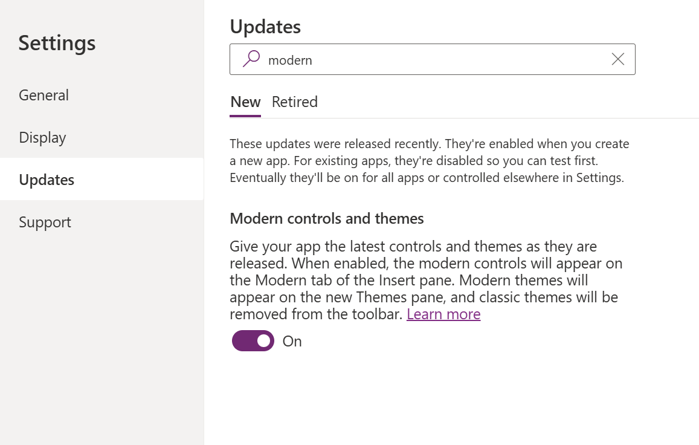
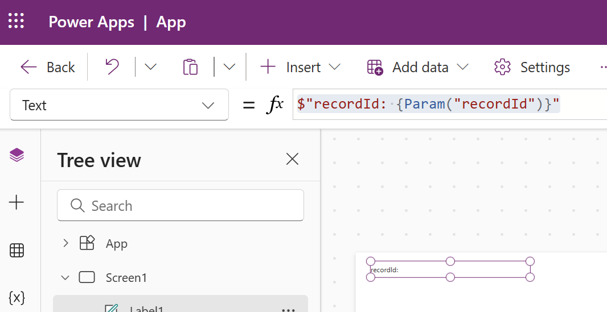
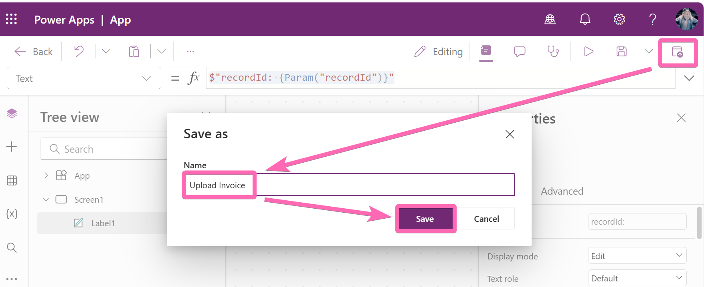
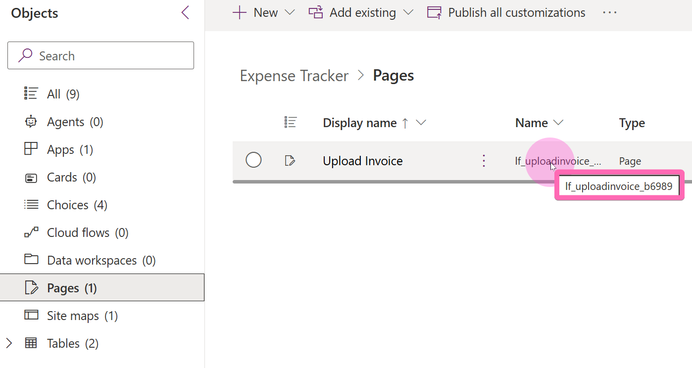
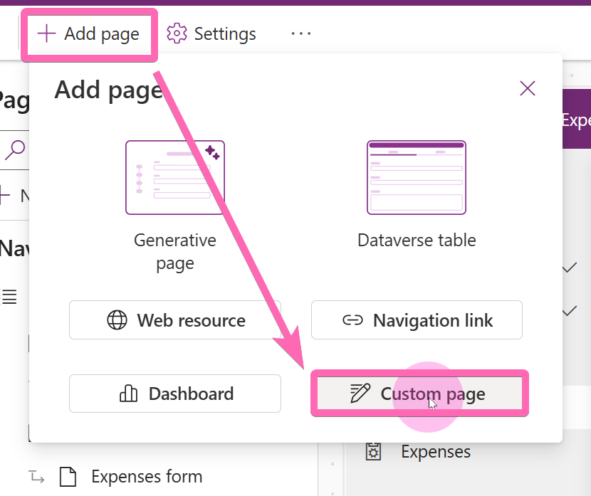
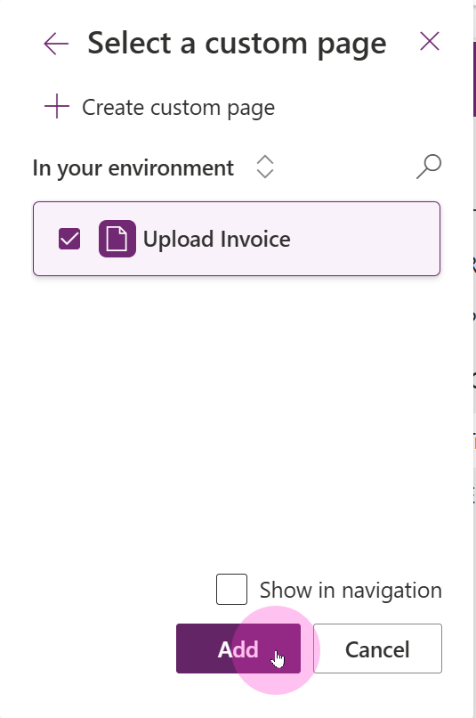

# Exercise 2: Creating Your First Custom Page

## Overview
In this exercise, you'll create a basic custom page that will display the ID of the current record. Custom pages bring canvas app flexibility into your model-driven app. We will upgrade this page later to a proper expense creation form.

## Scenario
We want to open a custom page from a trip record to create a new expense. To do this, we need to pass the trip's record ID to the custom page. In this exercise, we'll build a simple page that proves the ID is being received correctly - a debugging technique that saves time before building the full UI.

## Learning Objectives
- Create a custom page within your solution
- Enable modern controls for Fluent UI v2 consistency
- Use `Param()` to receive context from a model-driven app
- Add a custom page to your model-driven app

## Exercise Structure: Mainquests & Sidequests

> [!TIP]
> **Gaming-Inspired Learning**: This exercise uses a gaming approach to content organization:

**🎯 Mainquests** (Required for Everyone):
- Core functionality that everyone should complete
- Essential skills needed for custom page development

**⭐ Sidequests** (Optional for Fast Finishers):
- Advanced features for those who complete mainquests early

> [!IMPORTANT]
> **Pacing Strategy**: Focus on completing all mainquests first. Only attempt sidequests if you finish early and want additional challenges.

---

## 🎯 Mainquest Part 1: Create the Custom Page

### Step 1: Create a New Page

1. Navigate to your **Expense Tracker App solution**
2. Select **+ New** → **App** → **Page**



### Step 2: Enable Modern Controls

The page should fit into the **Fluent UI v2** design language. We need to enable modern controls for every custom page we create.

1. In the page designer, go to **Settings** → **Updates**
2. Enable **Modern Controls and Themes**



> [!TIP]
> **Why Modern Controls?** Modern controls follow the Fluent UI v2 design language, which ensures your custom pages visually match the rest of your model-driven app. This creates a seamless user experience.

---

## 🎯 Mainquest Part 2: Add a Debug Label

### Step 3: Display the Record ID

We want to use this page to create a new expense for an existing trip. The page will be opened from the trip form, so the most important information we need to receive is the **trip's record ID**.

1. Add a **Label** control to the page
2. Set the label's **Text** property to the following formula:

   ```
   $"recordId: {Param("recordId")}"
   ```



> [!IMPORTANT]
> **Understanding `Param()`**: The `Param()` function receives values passed from the model-driven app when opening the custom page. This is the primary way to pass context (like which record triggered the page) into your custom page. We'll use this ID later to link new expenses to the correct trip.

---

## 🎯 Mainquest Part 3: Add Page to Model-Driven App

### Step 4: Save and Publish the Page

1. Select **Save** and then **Publish**
2. Name the page `Upload Invoice`



### Step 5: Note the Logical Name

1. Return to your **Expense Tracker App solution**
2. The page should be visible after a moment
3. **Note down the logical name** (hover over it to display) — you will need it in a later exercise



> [!TIP]
> **Why the Logical Name?** The logical name is the internal identifier for your page. You'll need it when configuring the command bar button that opens this page (Exercise 3). Write it down or copy it somewhere accessible.

### Step 6: Add the Page to Your App

1. Open your **Expense Tracker** model-driven app in edit mode
2. Select **+ Add page** → **Custom page**
3. Select the **Upload Invoice** page you just created



### Step 7: Configure Navigation Settings

1. Uncheck **Show in Navigation** — we only want to display this page through a command bar button, not as a standalone navigation item



2. Select **Save** then **Publish**

> [!IMPORTANT]
> **Common Pitfall**: You **must** add custom pages to your model-driven app before they can be opened from command bar buttons. If you skip this step, nothing will happen when you click the button — no error, just silence. Always verify the page is registered in your app!

---

## Part 4: Understanding What You Built

### Key Concepts

- **Custom Pages**: Bring canvas app flexibility into model-driven apps while maintaining the enterprise structure
- **Param() Function**: The bridge between your model-driven app and custom pages — passes context like record IDs
- **Modern Controls**: Ensure visual consistency with the Fluent UI v2 design language across your entire app
- **Page Registration**: Custom pages must be explicitly added to your model-driven app before they can be invoked

### What's Next?

In [Exercise 3](03-open-page-webressource.md), you'll learn how to open this custom page from a command bar button on the Trip form, passing the record ID so the page knows which trip to work with.

---


**Need Help?** Raise your hand - we're here to help! 🙋‍♀️🙋‍♂️