# Exercise 3: Open a Custom Page from the Command Bar

## Overview
In this exercise, you'll connect the custom page you built in Exercise 2 to your model-driven app by adding a command bar button. When users click this button on a Trip form, it will open your custom page and pass the current trip's record ID — proving the connection works end-to-end.

## Scenario
We need a way for users to open the "Upload Invoice" custom page directly from a Trip record. To achieve this, we'll use a reusable JavaScript web resource that handles opening any custom page, and wire it up to a command bar button on the Trip form.

## Learning Objectives
- Create and configure a JavaScript web resource in your solution
- Understand how `Xrm.Navigation.navigateTo` opens custom pages
- Customize the command bar of a model-driven app form
- Pass record context from a form to a custom page
- Test the end-to-end flow from button click to page display


---

## 🎯 Mainquest Part 1: Create the Web Resource

### Step 1: Download and Add the Web Resource

1. Download the `openPage.js` file from the **downloads** folder
2. Navigate to your **Expense Tracker App solution**
3. Select **+ New** → **More** → **Web resource**
4. Upload the `openPage.js` file and configure the web resource

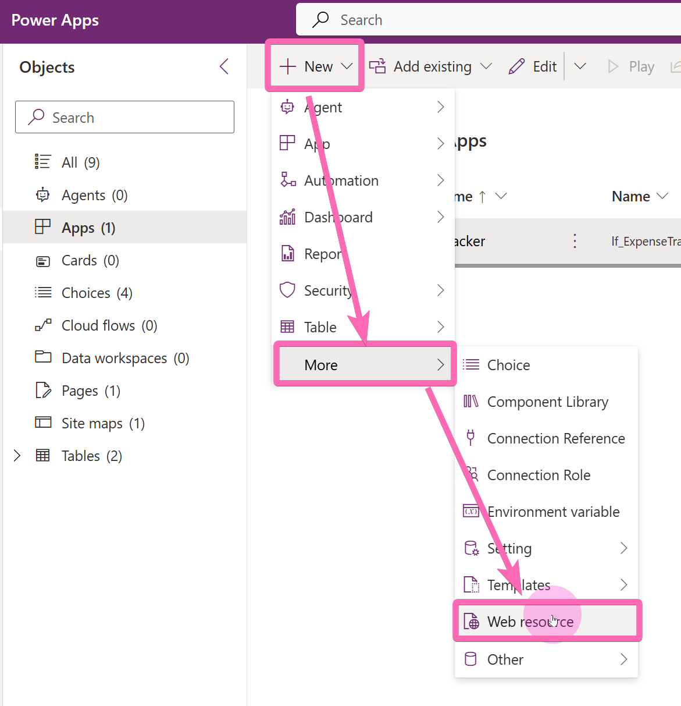

### Understanding the Web Resource

The `openPage.js` file contains a reusable `openPage` function that uses `Xrm.Navigation.navigateTo` to open any custom page from a model-driven app. It accepts two parameters:

- **`record`**: The ID of the current record (automatically stripped of curly braces so you don't have to handle that in your custom page)
- **`page_definition`**: A semicolon-separated string that controls how the page opens

The `page_definition` string format is:

```
Title;PageLogicalName;EntityName;Target;Width;Height
```

| Segment        | Description                                          | Default  |
| -------------- | ---------------------------------------------------- | -------- |
| `Title`        | Title displayed on the dialog                        | Required |
| `PageLogicalName` | Logical name of the custom page                   | Required |
| `EntityName`   | Additional parameter (retrievable via `Param()`)     | Optional |
| `Target`       | `main`, `center`, or `side`                          | `side`   |
| `Width`        | Width in `px` or `%` (e.g., `500px` or `30%`)       | `300px`  |
| `Height`       | Height in `px` or `%` (e.g., `500px` or `100%`)     | `100%`   |

> [!TIP]
> **Why a Reusable Web Resource?** Instead of writing new JavaScript for every custom page, this single function handles all of them. You only need to change the `page_definition` string parameter in the command bar — no code changes required. This keeps your solution clean and maintainable.

---

## 🎯 Mainquest Part 2: Add a Command Bar Button

### Step 2: Open the Command Bar Editor

1. In your **Expense Tracker** model-driven app, select the context menu (⋮) of the **Trip** table
2. Select **Edit command bar**

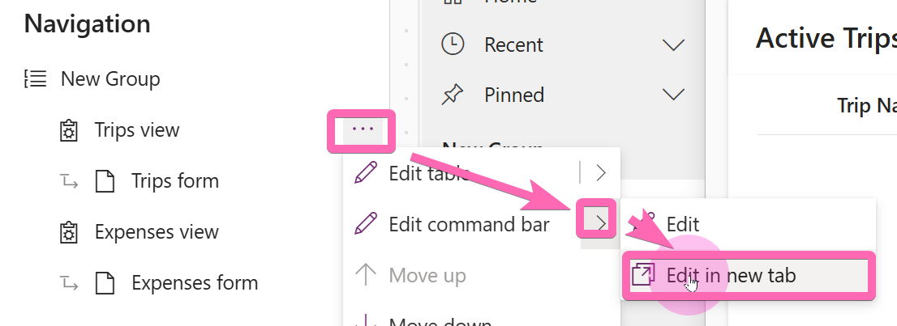

3. Select **Main form** and proceed — this will display all visible and hidden commands for the Trip form

### Step 3: Create a New Command

1. Select **+ New command** to add a new button

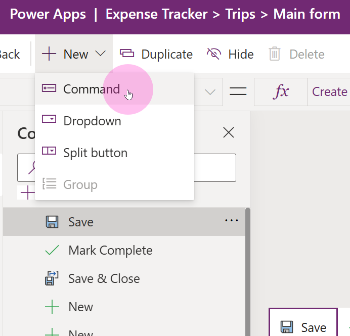

2. Select **JavaScript** as the action type

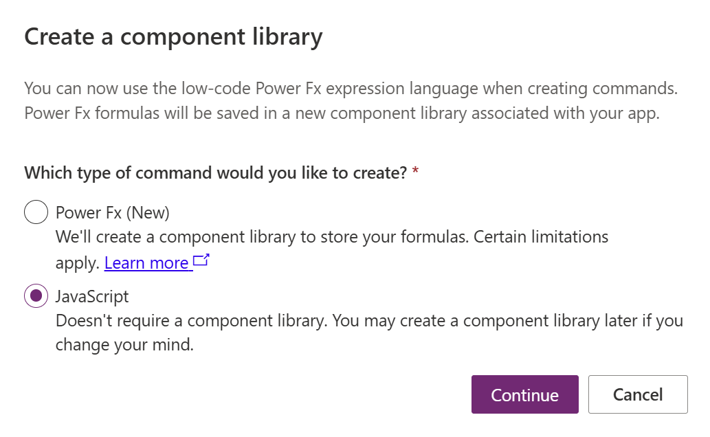

3. Choose a fitting **label** and **icon** for the command

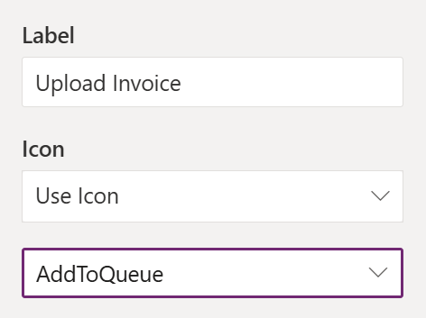

> [!TIP]
> **Custom Icons**: You can also upload custom SVG icons for your command bar buttons. This is useful when the built-in icon library doesn't have exactly what you need.

---

## 🎯 Mainquest Part 3: Configure the Function Call

### Step 4: Add the Web Resource Library

1. In the command configuration, add the **openPage** library — this is the web resource you created in Step 1

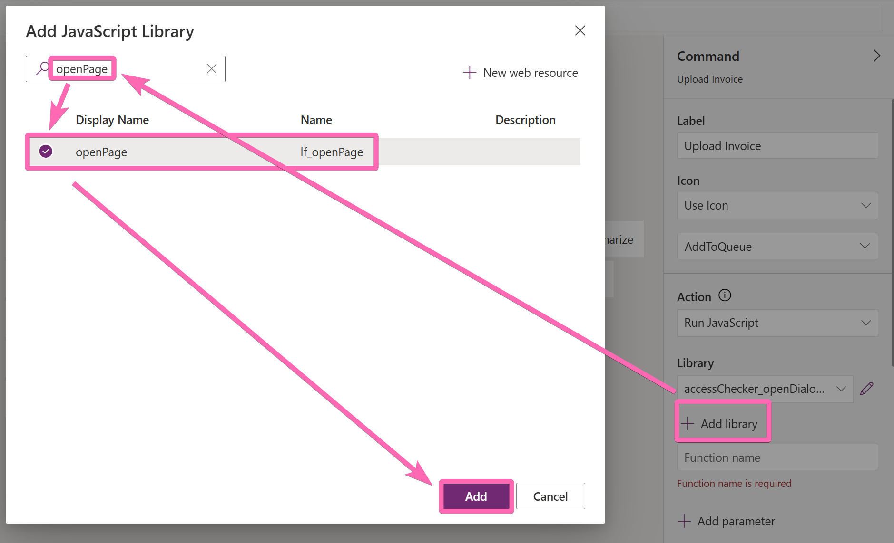

### Step 5: Set the Function Name

1. Set the function name to `openPage` — this must match the function name in the JavaScript file exactly

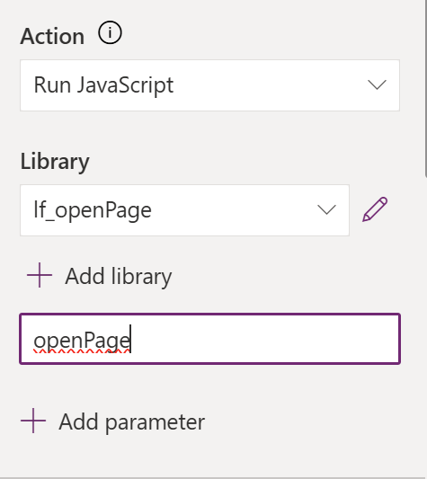

### Step 6: Add the Record ID Parameter

1. Add **FirstPrimaryItemId** as the first parameter — this automatically passes the ID of the current Trip record to the function

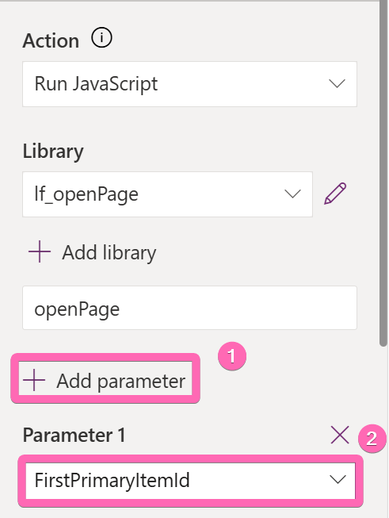

> [!IMPORTANT]
> **Parameter Order Matters**: The `openPage` function expects `record` as the first parameter and `page_definition` as the second. `FirstPrimaryItemId` provides the record ID automatically from the model-driven app context.

### Step 7: Add the Page Definition Parameter

1. Add a second **String** parameter with the page definition
2. For our scenario, the string should look like this:

   ```
   Upload Invoice;[your_page_logical_name]
   ```

   Replace `[your_page_logical_name]` with the logical name you noted down in [Exercise 2, Step 5](02-create-first-page.md#step-5-note-the-logical-name).

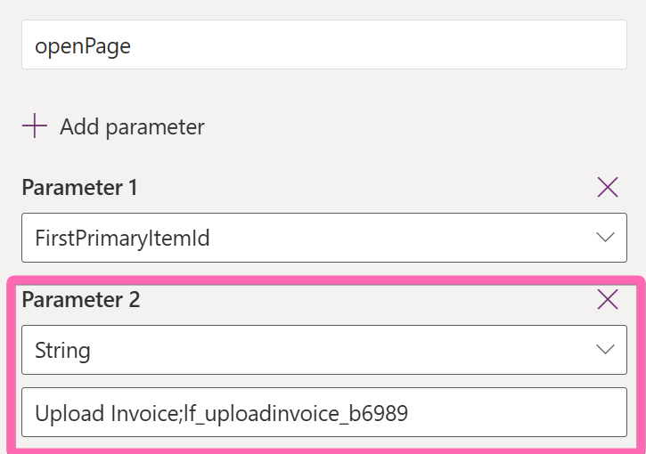

> [!IMPORTANT]
> **Your Logical Name Will Be Different**: The page logical name is unique to your environment and publisher prefix. If you didn't note it down earlier, go back to your solution, find the "Upload Invoice" page, and hover over it to see the logical name.

---

## 🎯 Mainquest Part 4: Publish and Test

### Step 8: Publish the Command Bar

1. Select **Save and publish** in the command bar editor

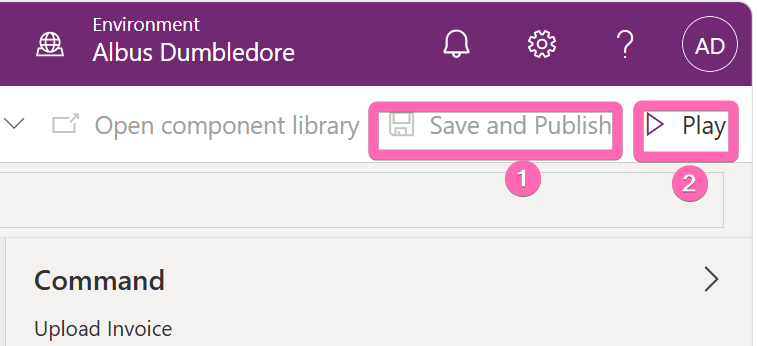

### Step 9: Test the Button

1. Open your **Expense Tracker** app
2. Navigate to a **Trip** record (create one if you haven't already)
3. You should see your new button in the command bar
4. Select the button — a dialog should open displaying the record ID of the current trip

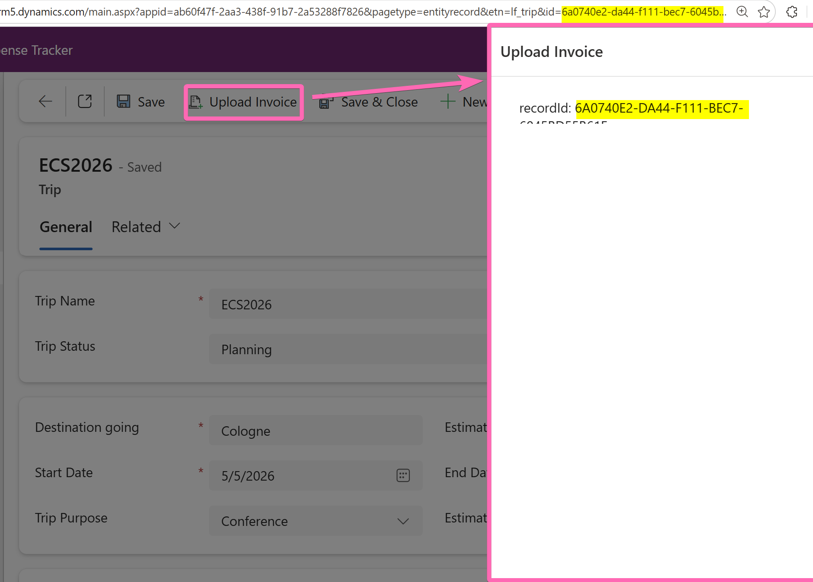

> [!TIP]
> **Debugging Tips**: If the button doesn't appear, verify you published the command bar. If clicking does nothing, double-check that you [added the custom page to your model-driven app](02-create-first-page.md#step-6-add-the-page-to-your-app) in Exercise 2. This is the most common mistake!

---

## ⭐ Sidequest: Add a Button to the Expense Subgrid

> [!NOTE]
> **Optional Challenge**: Complete this sidequest if you finish early and want to explore advanced command bar customization!

**Your Mission**: Add a button to upload an invoice from the **Expense subgrid** on the Trip form.

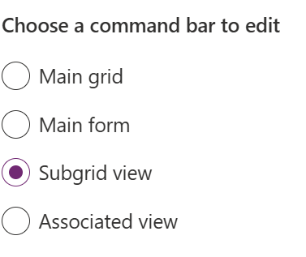

**Hints**:
- The procedure is the same as what you just did, but on the **command bar of the Expense table**
- You'll need to select the **Subgrid view** command bar instead of **Main form**
- Consider what record ID should be passed — the Trip ID or the Expense ID?

**Reflection Questions**:
- How does the subgrid command bar differ from the main form command bar?
- What other tables or views might benefit from custom page buttons?

---

## Part 5: Understanding What You Built

### Key Concepts

- **Web Resources**: JavaScript files stored in Dataverse that extend model-driven app functionality
- **`Xrm.Navigation.navigateTo`**: The API that opens custom pages, web resources, or entity forms as dialogs — [see examples](https://learn.microsoft.com/en-us/power-apps/developer/model-driven-apps/clientapi/navigate-to-custom-page-examples)
- **Command Bar Customization**: Adding buttons that trigger JavaScript functions with contextual parameters
- **FirstPrimaryItemId**: A built-in token that automatically provides the current record's ID

### The Reusability Pattern

The `openPage.js` web resource is designed to be reused across your entire solution:
- **One JavaScript file** handles all custom page navigation
- **Each button** only needs a different `page_definition` string
- **No code changes** required when adding new custom pages — just add a new command bar button

### What's Next?

You've now connected your custom page to the model-driven app. The page currently just displays the record ID as a debug label. In [Exercise 4](04-update-page.md), you'll upgrade this page to a full expense creation form with file upload capabilities.


---

**Need Help?** Raise your hand - we're here to help! 🙋‍♀️🙋‍♂️