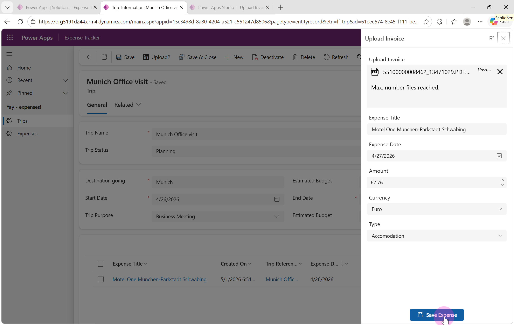
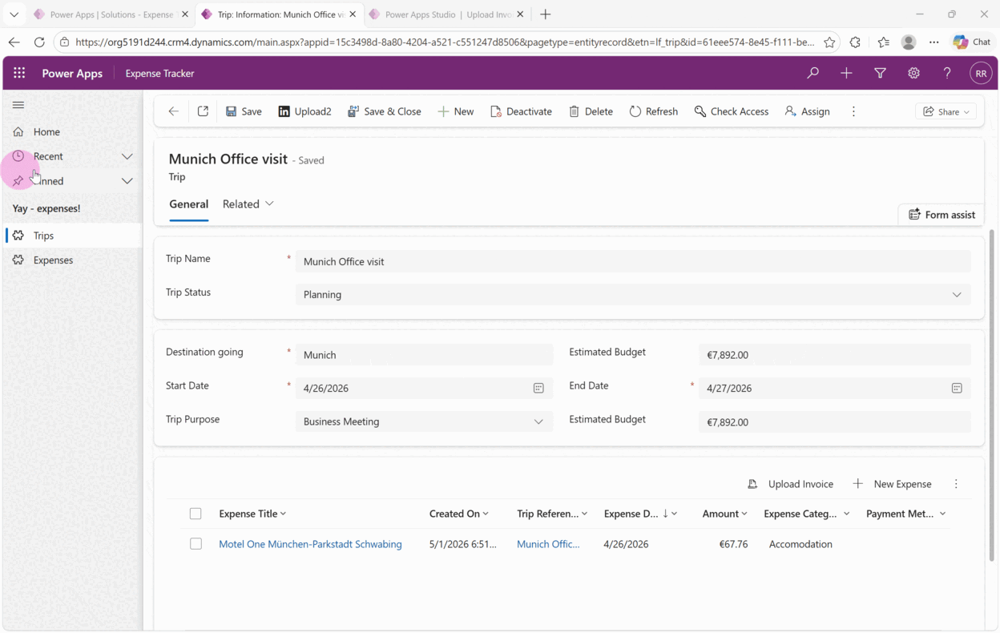
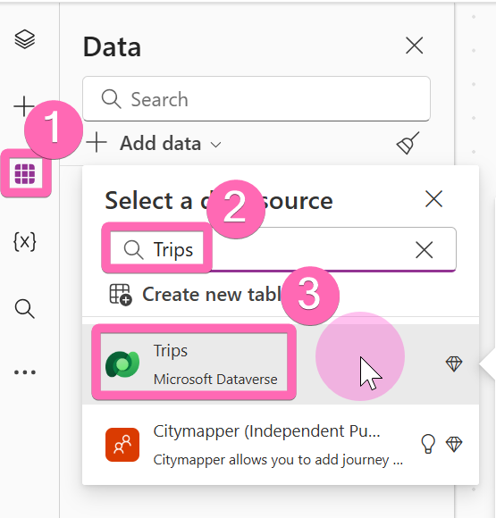
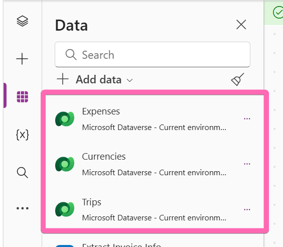
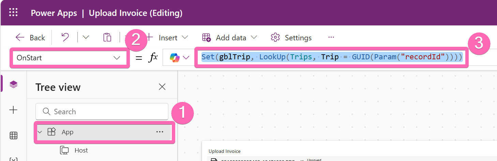
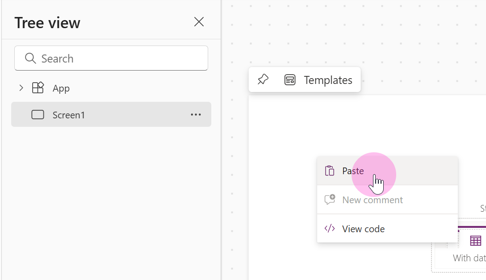
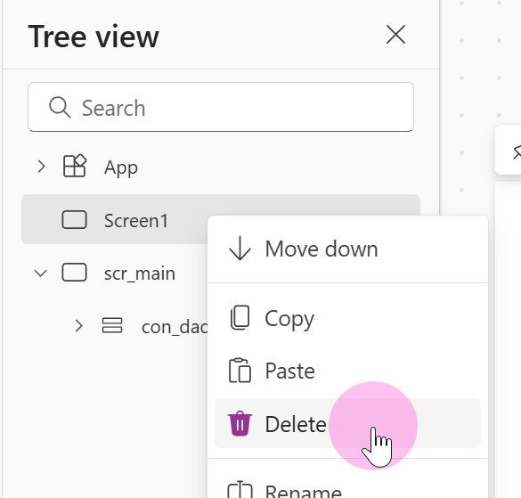
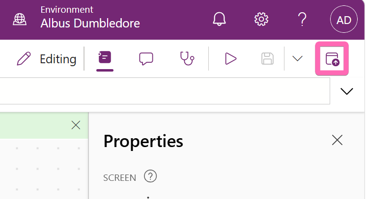

# Exercise 4: Building the Invoice Upload Page

## Overview
In this exercise, you'll transform the debug custom page from Exercise 2 into a fully functional invoice upload screen. When a user uploads an invoice file, the page will extract key data (vendor, amount, date, category) and create a new Expense record linked to the current Trip — all without leaving the model-driven app.

## Scenario
Our expense tracker needs a fast way to capture invoices. Instead of manually filling out every field, users should be able to upload an invoice and have the form pre-populated with extracted data. In this exercise we'll use **mock data** to simulate the extraction. In Exercise 5, we'll replace the mock data with a real AI-powered Custom Prompt.

## Learning Objectives
- Connect Dataverse tables to a custom page
- Use `LookUp()` and `Param()` to retrieve the current Trip record
- Build a responsive form using modern controls and auto-layout containers
- Use `Patch()` to create Expense records from a custom page
- Navigate back to the model-driven app after saving


---

## ⭐ Sidequest: Build It Yourself

> [!NOTE]
> **Optional Challenge**: If you're feeling confident and have time, try building the upload screen on your own before reading the guided adventure below!

Here's what the finished page looks like:





**Tips if you go solo**:
1. Add the **Trips**, **Expenses**, and **Currencies** tables to your custom page
2. Retrieve the trip from the record ID passed via `Param()` — we recommend doing this in `OnStart`
3. Use a form built from modern controls, or use the built-in Form control
4. Use `Navigate(Record)` to navigate back to the Trip record and reload it — see [Power Fx in model-driven apps](https://learn.microsoft.com/en-us/power-apps/maker/model-driven-apps/page-powerfx-in-model-app)

> [!IMPORTANT]
> **No spoilers!** If you take this path, skip ahead to [Mainquest Part 3: Publish and Test](#-mainquest-part-3-publish-and-test) when you're ready to verify your work.

---

## 🎯 Mainquest Part 1: Connect Data Sources

### Step 1: Add the Necessary Tables

1. Open your **Upload Invoice** custom page in edit mode
2. Add the following Dataverse tables as data sources:
   - **Trips** — so we can look up the current trip
   - **Expenses** — so we can create new expense records
   - **Currencies** — so users can select the correct currency from a dropdown





> [!TIP]
> **Why Currencies?** Since we used a Currency data type for the Amount field on the Expense table, Dataverse requires a currency reference when creating records via `Patch()`. The Currencies table is a standard Dataverse system table — you don't need to create it.

### Step 2: Get the Current Trip on Start

1. Select the **App** object in the tree view
2. Set the **OnStart** property to the following formula:

   ```
   Set(gblTrip, LookUp(Trips, Trip = GUID(Param("recordId"))))
   ```



> [!IMPORTANT]
> **What This Does**: When the custom page opens, `Param("recordId")` retrieves the Trip ID that was passed from the command bar button (via `FirstPrimaryItemId` in [Exercise 3](03-open-page-webressource.md)). The `LookUp()` function then fetches the full Trip record from Dataverse and stores it in the global variable `gblTrip`. This variable is used later to link the new expense back to the correct trip.

---

## 🎯 Mainquest Part 2: Add the Upload Screen

### Step 3: Paste the Screen Code

This workshop focuses on the integration between model-driven apps and custom pages, so rather than building every control by hand, we've provided a ready-made screen that uses **modern controls** with **responsive auto-layout containers** — a pattern you can reuse in your own projects.

1. Open [uploadscreen.txt](../downloads/uploadscreen.txt) file in github
2. Copy the **complete contents** of the file (you can use the button in the top right)
3. In the custom page editor, paste the code into your page
4. If you named your tables & fields differently you might see some errors you have to resolve



### Step 4: Remove the Old Screen

1. Delete the original **Screen1** — it's no longer needed since the pasted code includes a new screen



### Understanding the Screen Code

The pasted screen contains a complete expense entry form built with modern controls. Here's what each section does:

| Section | What It Does |
| --- | --- |
| **Attachment control** (`att_Invoice`) | Lets users upload a single invoice file |
| **OnAddFile** | Fires when a file is uploaded — currently uses **mock data** to simulate AI extraction (vendor, amount, date, category) |
| **Text/Number inputs** | Pre-populated with extracted values so users can review and correct before saving |
| **Currency dropdown** | Looks up the extracted currency code in the Currencies table |
| **Category dropdown** | Maps extracted categories to the global `Expense Type Values` choice set |
| **Save button** (`btn_submit`) | Calls `Patch()` to create a new Expense record linked to `gblTrip`, then calls `Navigate(gblTrip)` to return to the Trip form |

> [!IMPORTANT]
> **Mock Data Alert**: The `OnAddFile` handler currently returns **hardcoded mock data** instead of calling an AI service. This means every upload will show the same values (Hotel Excelsior, €677.26, etc.) regardless of what file you upload. In [Exercise 5](05-ai-builder.md), we'll replace this with a real **Custom Prompt** that uses AI to extract actual invoice data.

> [!TIP]
> **The `Navigate(gblTrip)` Pattern**: Calling `Navigate()` with a Dataverse record in a custom page tells the model-driven app to navigate to that record's form. This is a powerful pattern — after saving the expense, the user is taken straight back to the Trip form where they can see their new expense in the subgrid. See the [Power Fx in model-driven apps documentation](https://learn.microsoft.com/en-us/power-apps/maker/model-driven-apps/page-powerfx-in-model-app) for more navigation options.

---

## 🎯 Mainquest Part 3: Publish and Test

### Step 5: Publish the Page

1. Select **Save** and then **Publish** to push the updated page to your model-driven app



### Step 6: Test the Upload Flow

1. Open your **Expense Tracker** app
2. Navigate to a **Trip** record (or create a new one)
3. Select the **Upload Invoice** button in the command bar
4. The custom page should open as a dialog
5. Upload any file using the attachment control
6. Verify that the form fields are pre-populated with mock data:
   - **Expense Title**: Hotel Excelsior
   - **Date**: 2026-05-03
   - **Amount**: 677.26
   - **Currency**: EUR
   - **Category**: Accommodation
7. Select **Save Expense**
8. You should be navigated back to the Trip form
9. Check the **Expenses subgrid** — your new expense should appear

> [!TIP]
> **Troubleshooting**: If the button doesn't open anything, verify that the custom page is [registered in your model-driven app](02-create-first-page.md#step-6-add-the-page-to-your-app). If the form fields stay empty after upload, check that `OnStart` is correctly set and the `gblTrip` variable is populated.

---

## Part 4: Understanding What You Built

### Key Concepts

- **Data Sources in Custom Pages**: Custom pages can connect to any Dataverse table, giving you full read/write access from a canvas-style interface
- **`Patch()` for Record Creation**: Creates new records in Dataverse with field values from form controls — no connector or flow needed
- **`Navigate(Record)`**: A custom page–specific function that returns the user to a model-driven app form, creating a seamless round-trip experience
- **Mock Data Pattern**: Using hardcoded data during development lets you build and test the UI before integrating with external services

### What's Next?

The upload flow works, but every invoice returns the same mock data. In [Exercise 5](05-ai-builder.md), you'll replace the hardcoded response with a **Custom Prompt** powered by AI that actually reads the uploaded invoice and extracts real values.


---

**Need Help?** Raise your hand - we're here to help! 🙋‍♀️🙋‍♂️
