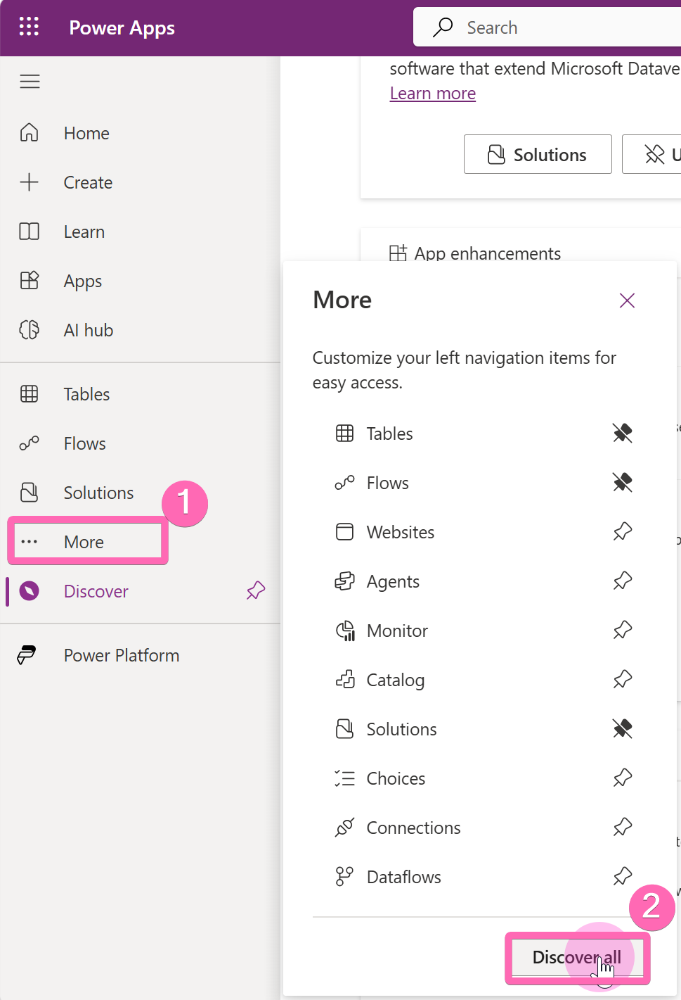
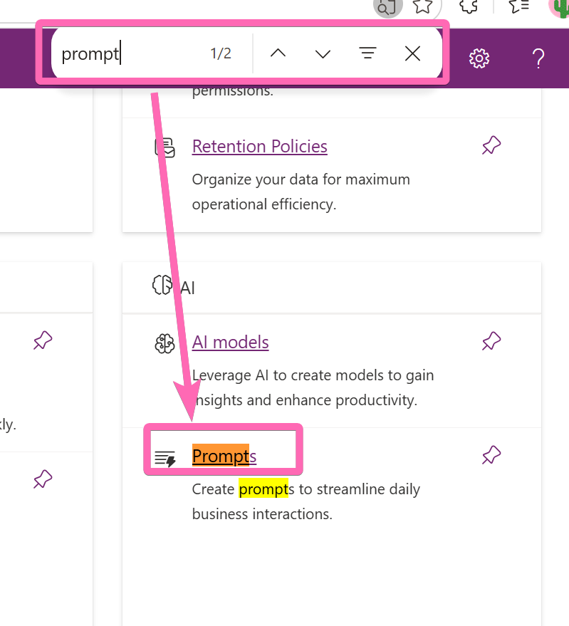
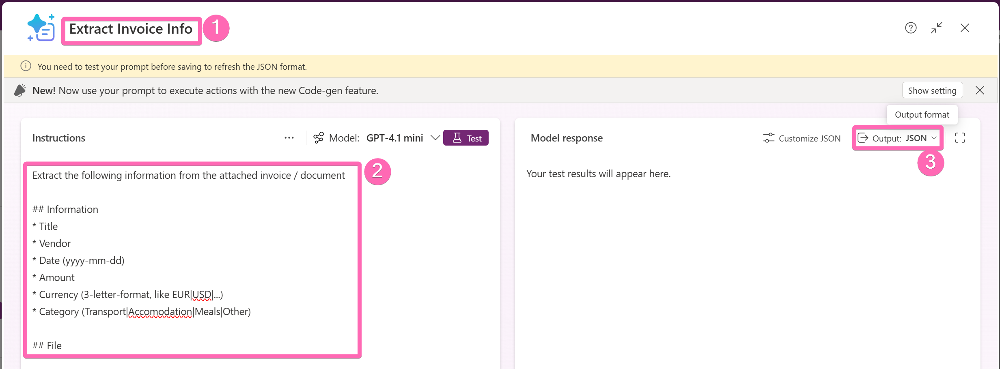
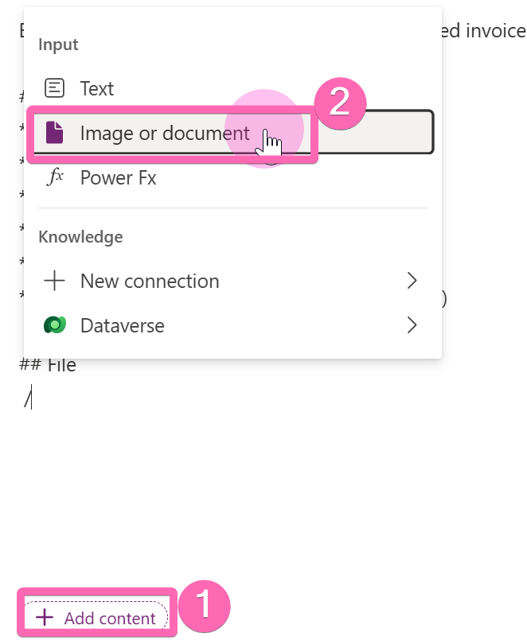
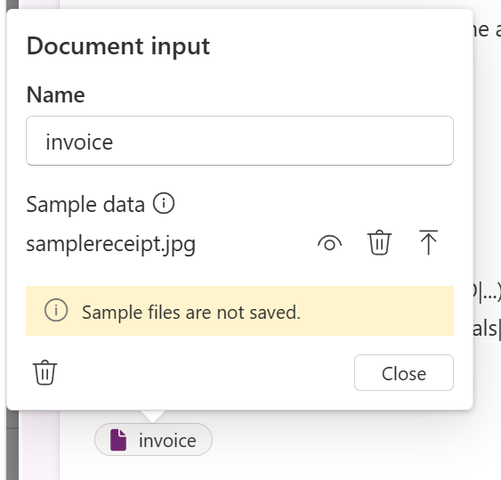
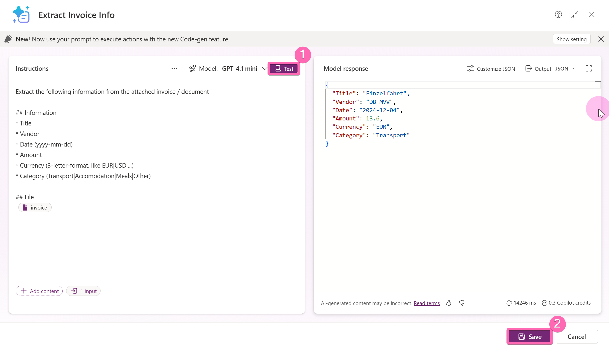
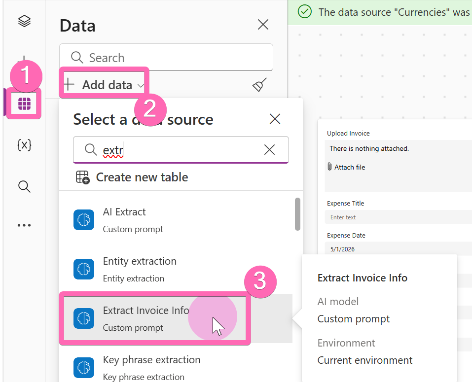
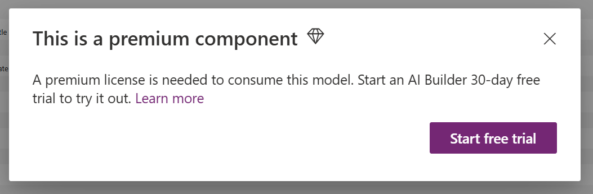
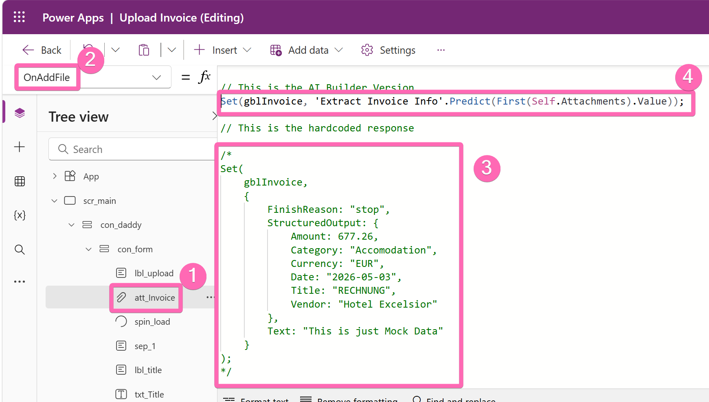

# Exercise 5: Adding AI with a Custom Prompt

## Overview
In this exercise, you'll replace the mock data from Exercise 4 with a real **AI Builder Custom Prompt** that extracts invoice information from uploaded files. When a user uploads an invoice, the AI will read the document and return structured data (vendor, amount, date, currency, category) — turning your upload page into an intelligent expense capture tool.

## Scenario
Our invoice upload page works, but every upload returns the same hardcoded values. We need actual intelligence. AI Builder's Custom Prompts let you define a natural language instruction, feed it a document, and get back structured JSON — all without writing a single line of traditional code. The prompt runs directly inside the custom page via Power Fx.

## Learning Objectives
- Navigate to and use the AI Builder Prompt feature in Power Apps
- Create a Custom Prompt with structured output and document input
- Test the prompt with a sample invoice
- Connect the prompt to a custom page as a data source
- Replace mock data with a real AI-powered extraction call

---

## 🎯 Mainquest Part 1: Navigate to AI Builder Prompts

### Step 1: Find the Prompts Feature

1. In [make.powerapps.com](https://make.powerapps.com), select **More** in the left sidebar



2. Press **Ctrl+F** to search for "Prompt", or scroll to the bottom of the list



> [!TIP]
> **Pin It!** Select the pin icon next to **Prompt** to add it permanently to your sidebar. You'll want quick access to this feature in future projects.

---

## 🎯 Mainquest Part 2: Create the Custom Prompt

### Step 2: Build the Prompt

1. Select **Build your own prompt**
2. Set the **title** to `Extract Invoice Info`
3. Add the following **instructions**:

   ```
   Extract the following information from the attached invoice / document

   ## Information
   * Title
   * Vendor
   * Date (yyyy-mm-dd)
   * Amount
   * Currency (3-letter-format, like EUR|USD|...)
   * Category (Transport|Accomodation|Meals|Other)

   ## File
   ```

4. Set the **output format** to **JSON**



> [!IMPORTANT]
> **Structured Output**: Setting the output to JSON ensures the AI returns data in a predictable format that Power Fx can parse. The field names in your instructions (Title, Vendor, Date, etc.) become the JSON keys. The format hints (like `yyyy-mm-dd` for dates and `EUR|USD` for currency) guide the AI to return consistent, machine-readable values.

### Step 3: Add the Document Input

1. Select **Add content** → **Image or document**
2. Use `invoice` as the input name



> [!TIP]
> **Input Name Matters**: The input name `invoice` must match the placeholder ` invoice ` in your prompt instructions. This is how the AI knows where to insert the uploaded document when processing the prompt.

### Step 4: Upload a Sample and Test

1. Upload a sample invoice or receipt to test the prompt — if you don't have one, use [samplereceipt.jpg](../downloads/samplereceipt.jpg) from the downloads folder



2. Select **Test** to run the prompt and verify the extracted data



3. Review the JSON output — check that all fields (Title, Vendor, Date, Amount, Currency, Category) are extracted correctly
4. Select **Save** when you're satisfied with the results

> [!TIP]
> **Add to Your Solution**: After saving, go to your **Expense Tracker App solution** and select **Add existing** → **AI Model** to include the prompt. This keeps everything organized for deployment.

---

## 🎯 Mainquest Part 3: Connect the Prompt to the Custom Page

### Step 5: Add the Prompt as a Data Source

1. Open your **Upload Invoice** custom page in the editor
2. Add the **Extract Invoice Info** prompt as a data source



> [!TIP]
> **Can't Find the Prompt?** If you didn't reopen the custom page editor, the new AI model may not appear in the data source list. Close and reopen the page, or use the **Refresh** button in the data sources panel.

3. If prompted to start a free trial, select **Start trial** — this will happen if you're using the workshop tenant



### Step 6: Update the Attachment Control Code

1. In the custom page editor, select the **att_Invoice** control
2. Navigate to the **OnAddFile** property
3. **Comment out** the hardcoded mock data section
4. **Uncomment** the AI Builder line that calls the prompt:

   ```
   Set(gblInvoice, 'Extract Invoice Info'.Predict(First(Self.Attachments).Value));
   ```



> [!IMPORTANT]
> **What Changed**: The single line `'Extract Invoice Info'.Predict(...)` sends the uploaded file to your Custom Prompt, which processes it through AI and returns the structured JSON response. The rest of the page code doesn't need to change — it already reads from `gblInvoice.StructuredOutput`, which now contains real extracted data instead of mock values.

---

## 🎯 Mainquest Part 4: Publish and Test

### Step 7: Test in the Editor

1. Select **Save** and then **Preview** (play button) in the custom page editor
2. Upload a sample invoice
3. Verify that the form fields are populated with **actual extracted values** from the document — not the mock data
4. Check that the values make sense: correct vendor name, accurate amount, proper date format

### Step 8: Test in the Model-Driven App

1. Select **Publish** to push the changes
2. Open your **Expense Tracker** app
3. Navigate to a **Trip** record
4. Select the **Upload Invoice** button in the command bar
5. Upload an invoice and verify the AI extraction works end-to-end
6. Select **Save Expense** and confirm the new expense appears in the Trip's subgrid

> [!TIP]
> **AI Processing Time**: The AI extraction may take a few seconds — you'll see the spinner while it processes. This is normal. If it fails, check that the AI Builder trial is active and that the prompt is added to your solution.

---

## ⭐ Sidequest: Experiment with Your Prompt

> [!NOTE]
> **Optional Challenge**: Complete this sidequest if you finish early and want to push the AI capabilities further!

**Your Mission**:
1. **Try Different Documents**: Upload receipts, invoices in different languages, or handwritten notes — see how the AI handles variety
2. **Refine the Prompt**: Add additional fields to extract (e.g., tax amount, invoice number, payment terms)
3. **Adjust Categories**: Modify the category list to match your organization's expense categories
4. **Test Edge Cases**: What happens with blurry images, multi-page documents, or non-invoice files?

**Reflection Questions**:
- How accurate is the extraction for different document formats?
- What prompt adjustments improve accuracy for your specific use case?
- How would you handle cases where the AI can't extract a field?

---

## Part 5: Understanding What You Built

### Key Concepts

- **AI Builder Custom Prompts**: Natural language instructions that process documents and return structured data — no ML expertise required
- **`.Predict()` Method**: The Power Fx function that sends input to an AI model and returns the result, usable directly in custom page formulas
- **Structured JSON Output**: Configuring the prompt to return JSON ensures predictable, parseable responses that integrate seamlessly with form controls
- **Document Intelligence**: The AI can read invoices, receipts, and other documents in multiple languages and formats

### The Complete Flow

You've now built a complete intelligent expense capture pipeline:
1. **User clicks** the Upload Invoice button on a Trip form (Exercise 3)
2. **Custom page opens** with the Trip context via `Param()` (Exercise 2 & 4)
3. **User uploads** an invoice file
4. **AI extracts** vendor, amount, date, currency, and category (this exercise)
5. **Form pre-populates** with extracted values for review
6. **User saves** and is navigated back to the Trip with the new expense visible

---

**Need Help?** Raise your hand - we're here to help! 🙋‍♀️🙋‍♂️